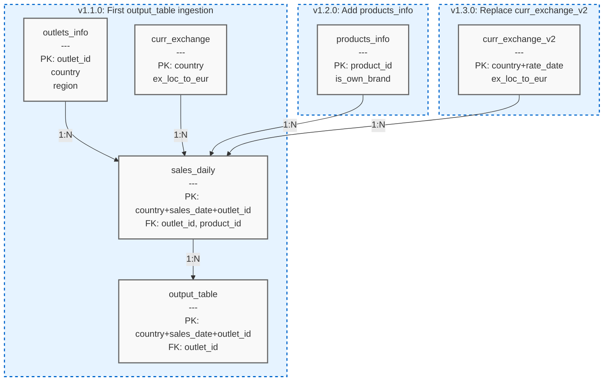

# Data Model Relationship Diagram  
*Versions 1.1.0 to 1.3.0*  

---

### **Key Entities**  
| Table               | Primary Key               | Foreign Key               |
|---------------------|---------------------------|---------------------------|
| `outlets_info`      | `outlet_id`               | -                         |
| `sales_daily`       | `country+sales_date+outlet_id` | `outlet_id`, `product_id` |
| `output_table`      | `country+sales_date+outlet_id` | `outlet_id`               |
| `products_info`     | `product_id`              | -                         |

### **Relationships**  
- **1:N**: `outlets_info` → `sales_daily`  
- **1:N**: `curr_exchange_v2` → `sales_daily` (v1.3.0+)  
- **1:N**: `products_info` → `sales_daily` (v1.2.0+)  
